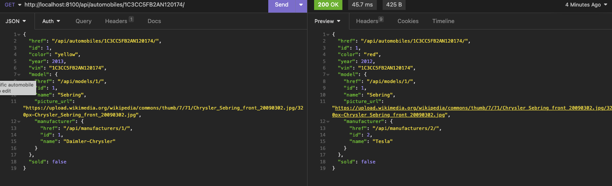

# CarCar

Team:

* Jessica - Service
* Tawain - Sales

## How to Run this App
1. Fork the repository for this project
2. Git clone this forked project in your projects directory
3. Build and run the project using Docker with these commands:

docker volume create beta-data
docker-compose build
docker-compose up

## Design
- **Inventory**
- **Services**
- **Sales**

## Service microservice
 Inventory API
1. Manufacturers URLS

2. Vehicle Modles URLS

3. Automobile URLS

Service API
1. Models

    Techinician:
    - first_name
    - last_name
    - employee_id
    Appointment:
    - date_time
    - reason
    - status
    - vin
    - customer
    - technician
    - vip (foreign key)
    AutomobileVO:
    - vin
    - sold

2. URLS/Routes

## Sales microservice

Explain your models and integration with the inventory
microservice, here.

CarCar is an app for Client-end management of an automobile service.
-It manages Inventory, Sales, and Service, along with the staff in said departments.
-Structurally the app is built on RestfulApi's for each service with intergrated polling on the service and sales branchs to allow for continuous updating of and fetching from the database. We used a react front end, designed to be new-user friendly and technician friendly, easily customizable to fit future client demands.

The Sales models include,
-Salesperson
It's fields include:
First name
Last name
Employee_Id- (a uuid number auto-generated to )
